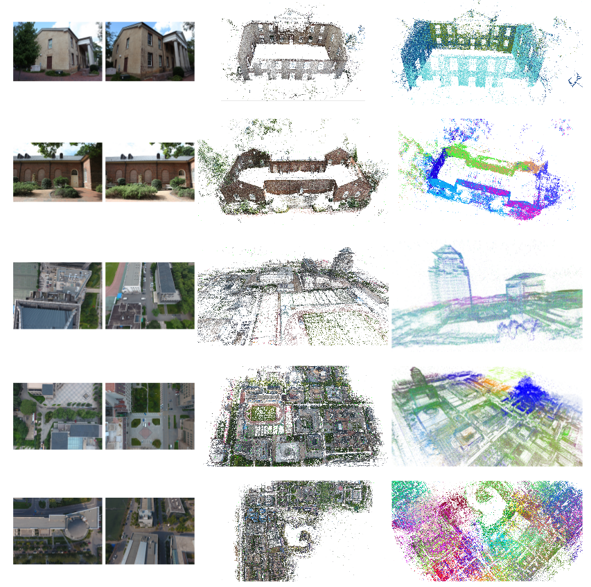
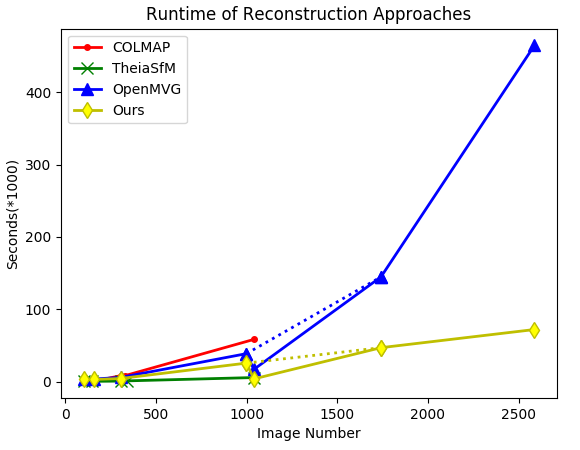

# Graph Structure from Motion (GSfM)
[](https://gitter.im/GraphSfM/Lobby)


[中文简介](./docs/README_ch.md)

## 1. Overview of GSfM
Our Structure from Motion approach, named **```Graph Structure from Motion```**, is aimed at large scale 3D reconstruction. Besides, we aimed at exploring the computation ability of computer and making SfM easily transferred to distributed system. Our work is partially based on an early version of [OpenMVG](https://github.com/openMVG/openMVG), while more robust and efficient than state-of-the-art open source Structure from Motion approaches (We rank **5-th** in [Tanks and Temples dataset](https://www.tanksandtemples.org/details) - the **highest** rank of open-source 3D reconstruction systems).

In our work, 3D reconstruction is deemed as a ```divide-and-conquer``` problem. Our adaptive graph cluster algorithm divides images into different clusters, while images with high relativity remained in the same group. The strong/weak spanning tree (ST) conditions enhance the connectivity between clusters, and make
multiple point clouds alignment more robust. After the completion of local SfM in all clusters, an elaborate graph initialization and MST construction algorithm is designed to accurately merge clusters, and cope well with drift problems. The two proposed graph-based algorithms make SfM more efficient and robust - the graph cluster algorithm accelerate the SfM step while gurantee the robustness of clusters merging, and the MST construction makes point clouds alignment as accurate as possible. Our approach can reconstruct large scale data-set in one single machine with very high accuracy and efficiency.

The pipleline of our SfM approaches is shown below:

<div align=center> 


</div>

More details about our **GSfM** can be found in [GSfM](./docs/GSfM_intro.md).

## 2. Experimental Results

### 2.1 Reconstruction results
The figure below is our reconstruction results. 

**Left:** raw images, **middle:** global sparse point cloud, **right:** point clouds where different parts are rendered in different colors. From top to bottom are respectively Gerrard Hall, Person Hall, Eastern Corner, Eastern Parts, Middle Parts. More reconstruction results can be found in [GSfM](./docs/GSfM_intro.md).

<div align=center> 



</div>

### 2.2 Statistic

Comparison of reconstruction results. N_p , N_c represents the number of 3D points and the number of recovered cameras, respectively. T_GC , T_SfM , T_PCA , T_P respectively denotes the time cost (seconds) of graph cluster step, local SfM step, point clouds alignment step, and the total time. The best results are highlighted in boldface. In **Person Hall** data-set, ```TheiaSfM``` failed due to the failure of finding an initial pair, ```OpenMVG``` failed due to blocked too long time when triangulation. The last three rows are large scale aerial data-sets, ```COLMAP``` takes too long time to finish such large scale datas, and ```TheiaSfM``` often produces bad parts in these data-sets, thus are not evaluated.

<div align=center> 


</div>

Besides, our reconstruction system, named **i23dMVS**, rank **5-th** in [tanks and temples](https://www.tanksandtemples.org/details/125/) dataset - the highest rank of all the open-source systems.

### 2.3 Runtime

The two dot lines show the real tendency of OpenMVG and our approach. The running time of ```COLMAP``` and ```OpenMVG``` grows quadraticly when the scale of images increases. ```TheiaSfM``` and our approach grows linearly, while our approaches more robust than TheiaSfM.

<div align=center> 


</div>

## 3. How to Build

### 3.1 Required
```
sudo apt-get install libpng-dev libjpeg-dev libtiff-dev libxxf86vm1 libxxf86vm-dev libxi-dev libxrandr-dev graphviz
```
### 3.2 Build
```bash
cd GraphSfM
mkdir build && cd build
cmake -D CUDA_USE_STATIC_CUDA_RUNTIME=OFF ..
make -j4
make test
```

## 4. Usage

For small scale reconstruction, just use the incremental SfM pipeline of [OpenMVG](https://github.com/openMVG/openMVG)
```bash
python build/software/SfM/SfM_SequentialPipeline.py $image_dir $output_dir
```

For large scale reconstruction, our GSfM is highly recommended.
```bash
python build/software/SfM/SfM_DC_Pipeline_singlematch.py $image_dir $output_dir $max_img_num
```

- ```$image_dir```:   The directory that stores images
- ```$output_dir```:  The directory that stores the reconstruciton results
- ```$max_img_num```: The maximum image number in each cluster. For example, ```80~120```.

